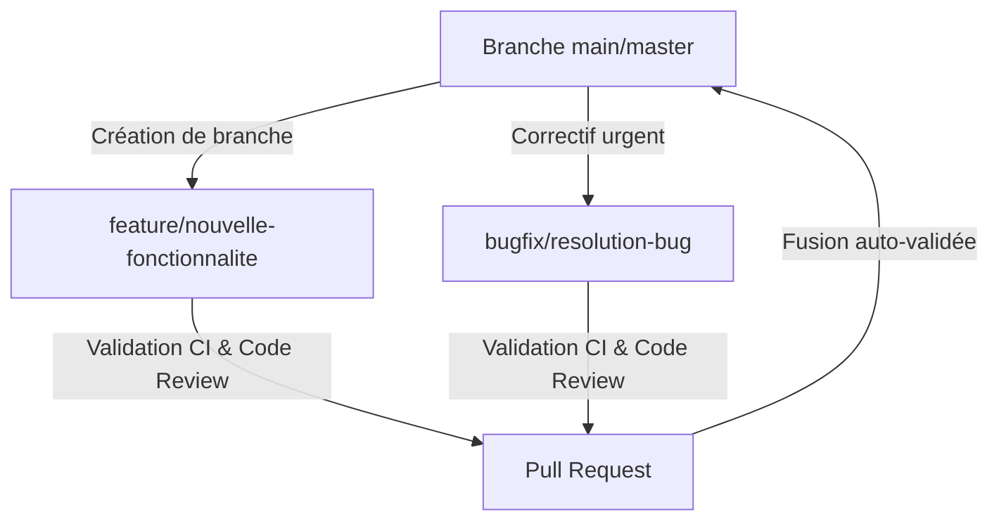

# 🏛️ Cabinet Comptaflow — Guide de Flux de Travail & Validation des PRs

Ce guide documente le processus de contribution, la stratégie de branches et les exigences de validation pour soumettre des Pull Requests (PRs) sur le projet **Compta-Flow**. L'objectif est d'assurer une stabilité totale de la plateforme à chaque intégration.

---

## 🛰️ 1. Stratégie de Branches & Git Flow

Nous suivons une approche inspirée de **Trunk-Based Development** avec des branches de fonctionnalités de courte durée pour minimiser les conflits de fusion :



### Nommage des Branches
*   **Fonctionnalités** : `feature/nom-de-la-fonctionnalite` ou `feat/nom-fonctionnalite`
*   **Corrections de bugs** : `bugfix/nom-du-bug` ou `fix/nom-bug`
*   **DevOps & Infrastructures** : `devops/description` ou `ci/description`
*   **Documentation** : `docs/description`

---

## 📝 2. Format des Commits (Conventional Commits)

Pour conserver un historique de version propre et générer automatiquement des logs de déploiement, tous les commits doivent respecter la structure suivante :

```text
<type>(<scope>): <description courte en français ou anglais>
```

### Types autorisés :
*   `feat` : Ajout d'une nouvelle fonctionnalité (ex: `feat(auth): integration de l'envoi d'email de confirmation`)
*   `fix` : Résolution d'un bug (ex: `fix(billing): correction du calcul des taxes au Québec`)
*   `refactor` : Modification du code qui n'ajoute pas de fonctionnalité ni ne corrige de bug (ex: `refactor(quotes): nettoyage des helpers de calcul`)
*   `test` : Ajout ou correction de tests unitaires/intégration (ex: `test(qa): validation du endpoint de devis`)
*   `docs` : Changements dans la documentation uniquement (ex: `docs(pr): ecriture du guide de workflow`)
*   `ci` ou `chore` : Modifications liées aux scripts CI/CD, outils de build, ou paquets npm (ex: `ci: configuration du workflow de PR`)

---

## 🛡️ 3. Critères de Validation Obligatoires (PR Gates)

Avant qu'une PR puisse être fusionnée dans la branche principale (`main` ou `master`), elle doit franchir avec succès les barrières de qualité suivantes :

### A. Exécution Automatique du PR-CI (GitHub Actions)
Chaque soumission ou mise à jour de Pull Request déclenche automatiquement le workflow `.github/workflows/pr-integrity.yml` qui exécute :
1.  **Linters & Compilation TypeScript** (`npm run lint` / `tsc --noEmit`) : Aucune erreur ou avertissement bloquant.
2.  **Suite de Tests Unitaires** (`npm test` / `vitest run`) : Taux de réussite de 100%.
3.  **Santé du Réseau Canadien** (`npm run verify:canada-module`) : Validation de l'intégrité du routage des 13 régions canadiennes.
4.  **Production Build** (`npm run build`) : Compilation finale Vite (client) + Esbuild (API Node.js) réussie.

### B. Modèle de PR dûment rempli
L'auteur de la PR doit remplir les sections du modèle prédéfini `.github/PULL_REQUEST_TEMPLATE.md`, spécifiant notamment :
*   Le type de modification.
*   Les portails administratifs impactés (Samuel, Viviane, Eya).
*   La validation du design system **Gold & Black** (responsivité et accessibilité).
*   Les politiques de sécurité (Row Level Security Supabase, non-exposition des secrets).

---

## 🚀 4. Recommandations de Reviewing (Pair-Programming)

Pour maintenir l'excellence opérationnelle :
*   **Auto-Revue** : Relisez votre propre code ligne par ligne sur GitHub avant de solliciter un collaborateur ou un agent autonome.
*   **Respect de l'existant** : Ne modifiez pas et ne supprimez pas de logique historique (notamment sur le routage ou le sitemap du Canada) sans l'avoir explicitement documenté et justifié.
*   **Clean Code** : Retirez tous les `console.log` de débogage temporaires, les bouts de code commentés ou inutilisés avant la finalisation de la PR.
